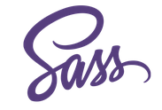

# Welcome!

> This application was based on Yeoman, Angular Fullstack so that developers and designers can quickly build a beautiful, compelling portfolio site.

## System Requirements

- [Yeoman](http://yeoman.io)
- [Angular-fullstack](https://github.com/DaftMonk/generator-angular-fullstack)
- [Grunt](http://yeoman.io)
- [Bower](http://bower.io)
- [Sass](http://sass-lang.com/)

## Built-in SASS Solutions

- [Cloudinary](http://yeoman.io)
- [Google Analytics](http://www.google.com/analytics)

## Support

Need help or have a question?

Please use the issue tracker for support/questions.

